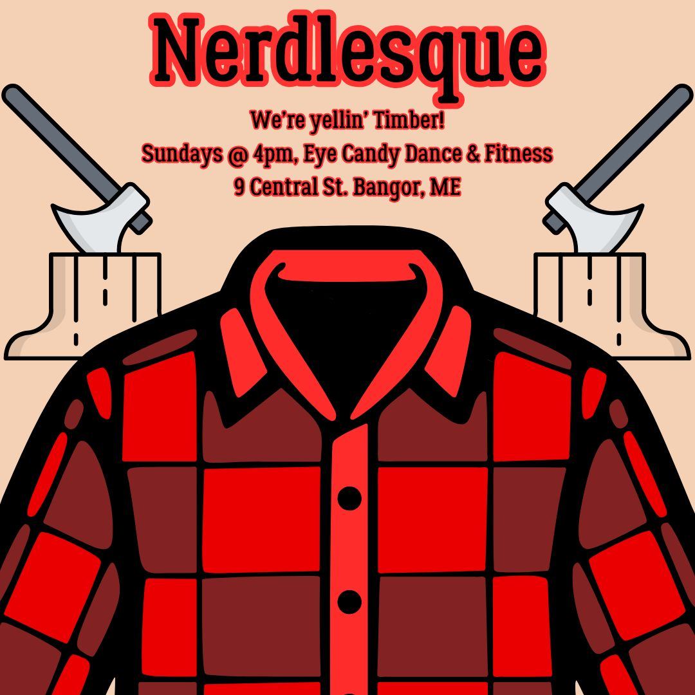
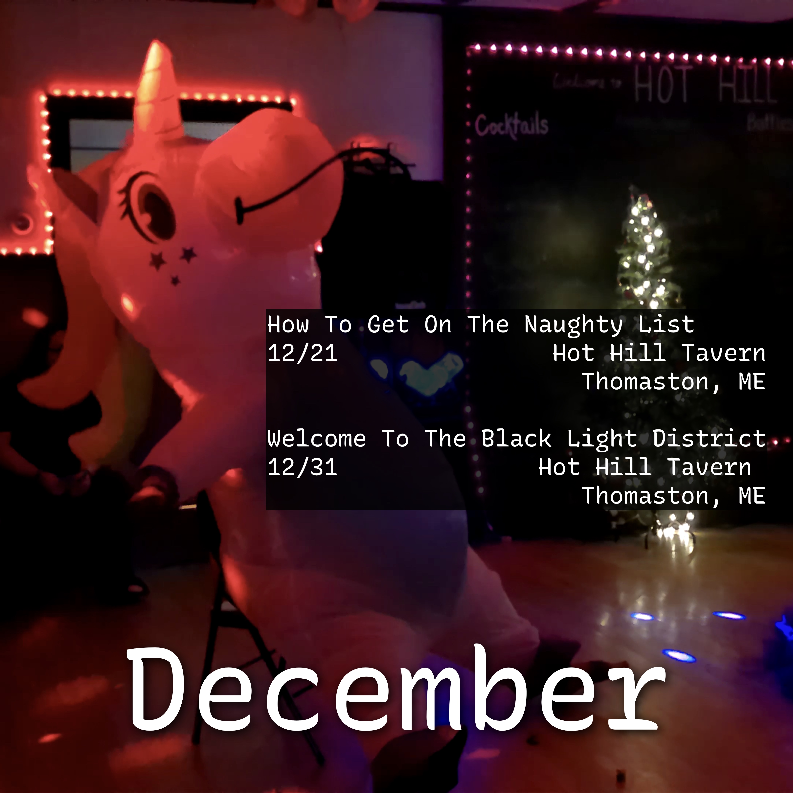

# About

Howdy! Thanks for stopping by! I'm Jenni Darkbloom, a burlesque dancer, teacher, and [kitten](https://kittening.darkbloom.dance). I started performing in 2023, based out of Maine, and often perform with The Eye Candy Bombshells.

We can _all_ win, and I get super excited about collaboration.

I've had the pleasure of working with lovely and talented people, including:
- [Eye Candy Dance and Fitness](https://www.facebook.com/profile.php?id=100078283869662)
- [Mak the Knife](https://www.youtube.com/@mak_the_knife/featured)
- [King Lyreck](https://www.facebook.com/connora.caron)
- [Lady D's Delicious Drag Divas](https://www.facebook.com/DeliciousDragDivas/)
- [Maine House of Comedy](https://www.mainehouseofcomedy.com)
- [A La Tarte Burlesque](https://www.instagram.com/a_la_tarte_burlesque)

If you'd like to create something, let's chat! [Instagram](https://www.instagram.com/jennidarkbloom/) or [E-Mail](mailto:jennidarkbloom@gmail.com) are the best ways to get in touch.

# Classes

Sundays at 4pm, I teach [Nerdlesque at Eye Candy in Bangor](https://www.eyecandybangor.com/product/sunday-4pm-nerdlesque/351).

For our next showcase (Feburary 2025) we're dancing to Pitbull and Kesha's tune Timber.

Wear something comfy to class. Don't forget that Galaxy Frog says, "Stay hydrated"!

# Upcoming Shows

## December 31st - Welcome To The Black Light District at Hot Hill Tavern in Thoamston, ME

Show starts at 8, then we'll be having a dance party to ring in the new year. Tickets are on the [Eye Candy Site](https://www.eyecandybangor.com/product/dec-31-welcome-to-the-black-light-district/509)

 
 
 
 

# Past Shows

## 2024
✨ = Solo act debut

- ✨December 21st - How To Get On The Naughty List at Hot Hill Tavern in Thomaston, ME
    - Solid show, Hot Hill is lovely.
- November 30th - Thanksgiving Spread at Hot Hill Tavern in Thomaston, ME
    - Sold out, and we had a guest performer 🥰
- November 16th - Spanksgiving Showcase at The Ten Buck Theater in Bangor, ME
    - This show was incredible. Sold out, a bunch of students had their first time on stage, and we had 6 new additions to the Candy Bombshells.
- ✨October 26th - Halloween Burlesque at [Hot Hill Tavern](https://hothilltavernme.com) in Thomaston, Maine with [Eye Candy Dance and Fitness](https://www.instagram.com/eye_candy_dance_bangor/)
- October 18th - [Vamps and Tramps](https://www.eventbrite.com/e/vamps-and-tramps-burlesque-show-tickets-1008590008867) at [Craft Brew Underground](http://craftbrewunderground.net) in Auburn, Maine with [Ala Tarte Burlesque](https://www.instagram.com/a_la_tarte_burlesque/)
- September 21st - World of Burlesque at [Ten Bucks Theater](http://www.tenbuckstheatre.org) in Bangor, Maine
- September 14th - [Lady D's Lip Sync Smackdown](https://www.facebook.com/events/513484677865639/) at the [Center Theater](https://www.centertheatre.org) in Dover-Foxcroft, ME
- ✨August 23rd - Welcome To The Dungeon at [Hot Hill Tavern](http://hothilltavernme.com) in Thomaston, Maine
- ✨August 10th - Giggles and Wiggles at [Basil Burwell Community Theater](https://belfastmaskers.com) in Belfast, Maine with The Eye Candy Bombshells and [Maine House of Comedy](https://www.mainehouseofcomedy.com)
- July 26th - 80s Night at [Hot Hill Tavern](http://hothilltavernme.com) in Thomaston, Maine
- July 6th - [Summer Sidewalk Art Festival](https://downtownbangor.com/events/summer-sidewalk-art-festival-in-downtown-bangor/) in Bangor, Maine
- ✨ June 28th - Back to the 80s at Benjamin's Pub in Bangor, Maine
- June 22nd - [Bangor Pride](https://www.bangorpride.com/), Maine
- June 15th - [Pride Aroostook](https://www.pridearoostook.com/) at [The Northeastland Hotel](https://thenortheastlandhotel.com) in Presque Isle, Maine
- June 8th - [Brunswick Pride](https://brunswickpride.org/), Maine
- June 1st - Wild Summer Nights (also known as, "The Messy Show" in the green-room group chat) at [Hot Hill Tavern](http://hothilltavernme.com) in Thomaston, Maine
- May 4th - Girls Just Want To Have Fun at The Franklin Vets Club in Franklin, Maine
- April 20th - Boobies and Doobies at [Hot Hill Tavern](http://hothilltavernme.com) in Thomaston, Maine
- April 13th - What's Your Fantasy at [The Blue Sky Lounge](https://www.facebook.com/blueskyloungebangor/) in Bangor, Maine
- March 29th - Bringing Sexy Back at [The Morgan Hill Event Center](https://www.morganhilleventcenter.com) in Hermon, Maine
- March 26th - World of Burlesque at [The Colonial Theatre](https://colonialtheatre.com) in Belfast, Maine
- March 16th - St. Patty's Day at Kanù in Old Town, Maine
- February 17th - Lonely Hearts Club at [Jeff's Catering](https://jeffscatering.com) in Brewer, Maine with The Delicious Drag Divas and The Eye Candy Bombshells
- February 10th - Cupid's Delight at [Hot Hill Tavern](http://hothilltavernme.com) in Thomaston, Maine
- February 3rd - Burlesque at Benjamin's Pub in Bangor, Maine

# Solo Acts

## Amelia Arsenic - Choke

This was my first ever solo, and easily my most refined. Jenni the Vampiress is looking for a victim, and hoo boy does she find one.

## Frankie Yankovic - Who Stole The Keeshka

I got a butcher shop to open where on Earth did my huge sausage go? Oh f--k oh s--t oh no no no where is it!?! Oh there it is. Nice.

## Tweaker - Worse Than Yesterday

A 2005 vintage mall-goth doing slow seductive propwork to a slow seductive tune.

## Blue Brew Music - Mii Channel

Jenni is running late (or had to leave early), but got her bestie, Sparkles Moonbeam (an 8 foot tall unicorn) to fill in for her. Chair acro!

## Mellowdrone - Orange Marmalade

KRAMPUS ACT! KRAMPUS ACT!

